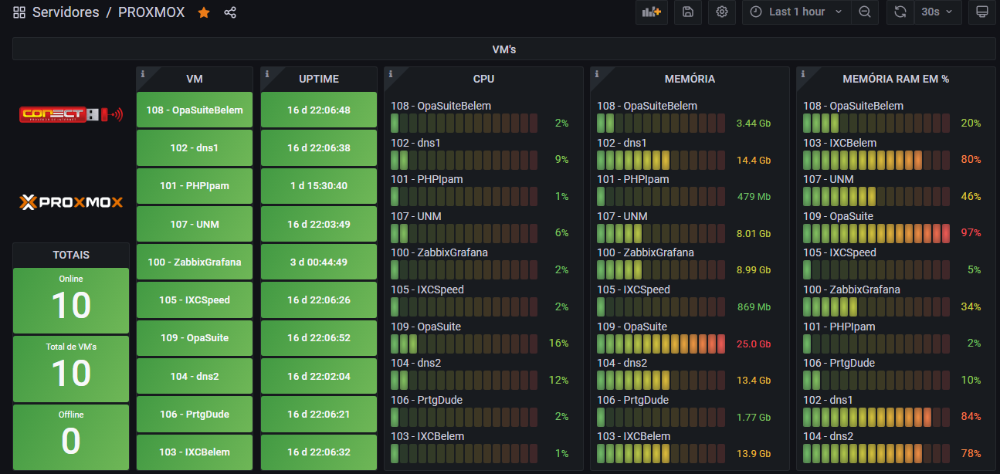

# PROXMOX + PYTHON + ZABBIX + GRAFANA



## Comandos Remotos

> Habilite os comando remotos no zabbix agent

- Tutorial [Zabbix Remote Commands](https://blog.zabbix.com/zabbix-remote-commands/7500/ "blog.zabbix.com")


- Video [Zabbix Remote Commands](https://www.youtube.com/embed/CMlpFuGBruE "Zabbix Remote Commands")


## Python

> Bibliotecas ultilizadas

1) proxmoxer
2) json
3) sys

> Como execultar o script ?

- python3 + local do script + ip do servidor + usurario do proxmox + senha do proxmox

```sh
# Exemplo:
python3 /home/script/py/proxmox.py 127.0.0.1 root@pam superSenha123
```

> Script

```py
from proxmoxer import ProxmoxAPI
import json, sys
params = sys.argv
proxmox = ProxmoxAPI(params[1], user=params[2], password=params[3], verify_ssl=False)
result = proxmox.cluster.resources.get()
s1 = json.dumps(result)
print(s1)
```

## Sobre o Template Zabbix

> filtro de contadem de itens correspondentes

```sh
$[?(@.canal== "whatsapp")].length()
```

> macro LLD para armazenar o nome, tipo e id da vm

```md
{#NAME} -> $.name
{#TYPE} -> $.type
{#VMID} -> $.vmid
{#STORAGE} -> $.storage
```

> contador de vms, storages e nodes (total)

```js
$.length()
$.[?(@.type == 'qemu')].length()
$.[?(@.type == 'storage')].length()
$.[?(@.type == 'node')].length()
```

> contador de vms (ligadas)

```js
$.[?(@.status == 'running')].length()
```

> contador de vms (deligadas)

```sh
$.[?(@.status == 'stopped')].length()
```

> filtros de contagem dos protótipos de itens tipo vm

```sh
$.[?(@.name == '{#NAME}')].cpu.first()
$.[?(@.name == '{#NAME}')].uptime.first()
$.[?(@.name == '{#NAME}')].mem.first()
$.[?(@.name == '{#NAME}')].status.first()
$.[?(@.name == '{#NAME}')].maxcpu.first()
$.[?(@.name == '{#NAME}')].maxmem.first()
$.[?(@.name == '{#NAME}')].netin.first()
$.[?(@.name == '{#NAME}')].netout.first()
```

> Item de calculo de porcentagem de memória ram da vm

```js
100*last("vm.mem[{#NAME}]")/last("vm.maxmem[{#NAME}]")
```

> filtros de contagem dos protótipos de itens tipo storage

```js
$.[?(@.storage == '{#STORAGE}')].disk.first()
$.[?(@.storage == '{#STORAGE}')].maxdisk.first()
```

> Item de calculo de porcentagem de armazenamento do storage

```js
100*last("storage.disk[{#STORAGE}]")/last("storage.maxdisk[{#STORAGE}]")
```

> filtros de contagem dos protótipos de itens tipo strage

```sh
$.[?(@.id == '{#id}')].disk.first()
```

> Alterando valores de retorno de status da vm de running ou stopped para 1 ou 0

```js
if (value == 'running'){
    return 1;
} else {
    return 0;
}
```
