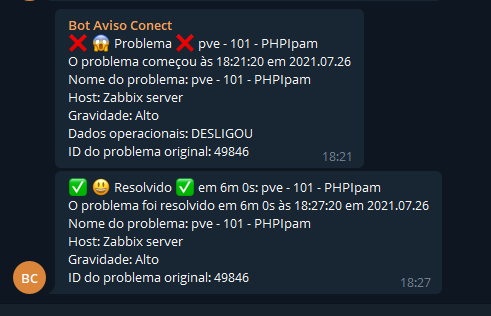

# PROXMOX 6.3-2 + ZABBIX 5.0.14 + GRAFANA 8.1.1

## Usando item HTTP AGENT

## [Saulo Costa - Telegram](https://t.me/saulos2costa/ "telegram")




- [Dashborad Grafana](/contents/dash_grafana.json "Dashborad Grafana")

## Sobre o Template Zabbix

> Adicione suas macros no host


> Macros LLD

```js
{#NAME} -> $.name
{#TYPE} -> $.type
{#VMID} -> $.vmid
{#STORAGE} -> $.storage
{#NODE} -> $.node
```

> Contador de vms, storages e nodes (total)

```js
$.body.data[?(@.type == 'qemu')].length()
$.body.data[?(@.type == 'storage')].length()
$.body.data[?(@.type == 'node')].length()
```

> Contador de vms (ligadas)

```js
$.[?(@.status == 'running')].length()
```

> Contador de vms (deligadas)

```js
$.[?(@.status == 'stopped')].length()
```

> Filtros de contagem dos protótipos de itens tipo vm

```js
$.[?(@.name == '{#NAME}')].status.first()
$.[?(@.name == '{#NAME}')].uptime.first()
$.[?(@.name == '{#NAME}')].cpu.first()
$.[?(@.name == '{#NAME}')].maxcpu.first()
$.[?(@.name == '{#NAME}')].mem.first()
$.[?(@.name == '{#NAME}')].maxmem.first()
$.[?(@.name == '{#NAME}')].netin.first()
$.[?(@.name == '{#NAME}')].netout.first()
```

> Item de calculo de porcentagem de memória ram da vm

```js
100*last("vm.mem[{#NAME}]")/last("vm.maxmem[{#NAME}]")
```

> Alterando valores de retorno de status da vm de running ou stopped para 1 ou 0

```js
if (value == 'running'){
    return 1;
} else {
    return 0;
}
```

> filtros de contagem dos protótipos de itens tipo storage

```js
$.[?(@.storage == '{#STORAGE}')].disk.first()
$.[?(@.storage == '{#STORAGE}')].maxdisk.first()
$.[?(@.storage == '{#STORAGE}')].status.first()
```

> filtros de contagem dos protótipos de itens tipo storage

```js
$.[?(@.storage == '{#STORAGE}')].disk.first()
$.[?(@.storage == '{#STORAGE}')].maxdisk.first()
$.[?(@.storage == '{#STORAGE}')].status.first()
```

> Alterando valores de retorno de status do node de available para 1

```js
if (value == 'available'){
    return 1;
} else {
    return 0;
}
```

> Item de calculo de porcentagem de armazenamento do storage

```js
100*last("storage.disk[{#STORAGE}]")/last("storage.maxdisk[{#STORAGE}]")
```

> Contador de storages disponíveis ou inidiponíveis

```js
$.[?(@.status == 'available')].length()
$.[?(@.status == 'unavailable')].length()
```

> filtros de contagem dos protótipos de itens tipo node

```js
$.[?(@.node == '{#NODE}')].disk.first()
$.[?(@.node == '{#NODE}')].maxdisk.first()
$.[?(@.node == '{#NODE}')].uptime.first()
$.[?(@.node == '{#NODE}')].mem.first()
$.[?(@.node == '{#NODE}')].maxmem.first()
$.[?(@.node == '{#NODE}')].maxcpu.first()
$.[?(@.node == '{#NODE}')].status.first()
$.[?(@.node == '{#NODE}')].cpu.first()
```

> Item de calculo de porcentagem de memoria ram  e disco do node

```js
100*last("node.mem[{#NODE}]")/last("node.maxmem[{#NODE}]")
100*last("node.disk[{#NODE}]")/last("node.maxdisk[{#NODE}]")
```

> Alterando valores de retorno de status do node de online e offiline para 1 ou 0

```js
if (value == 'online'){
    return 1;
} else {
    return 0;
}
```
