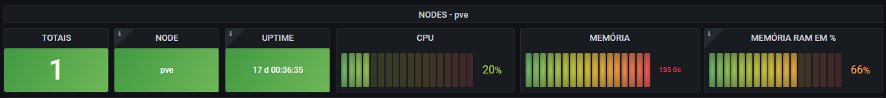
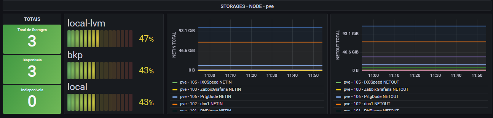
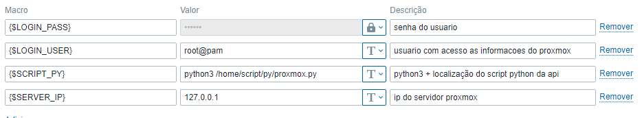

# PROXMOX + PYTHON + ZABBIX + GRAFANA

## [Saulo Costa - Telegram](https://t.me/saulos2costa/ "telegram")






- [Dashborad Grafana](/contents/dash_grafana.json "Dashborad Grafana")

## Comandos Remotos

> Instale e habilite os comando remotos no zabbix agent

- Tutorial [Zabbix Remote Commands](https://blog.zabbix.com/zabbix-remote-commands/7500/ "blog.zabbix.com")


- Video [Zabbix Remote Commands](https://www.youtube.com/embed/CMlpFuGBruE "Zabbix Remote Commands")


> Intale o zabbix-get no servidor zabbix

```sh
apt install zabbix-get
```

> Intale o zabbix-agent no servidor proxmox

```sh
apt install zabbix-agent
```

> Edite as configurações do agent para liberar o acesso ao server em...

```sh
nano /etc/zabbix/zabbix_agentd.conf
```


> Para testar a conexão entre o zabbix server e o agent...

- zabbix_get -s IP_DO_PROXMOX -k "system.uptime"

```sh
# Exemplo:
zabbix_get -s 172.31.255.2 -k "system.uptime"
```

> Se tudo estiver ok no zabbix o host ficará assim...


## Python<!--  - by [Ananias Filho](https://github.com/ananiasfilho "github.com") -->

> Instalando o PIP

```sh
apt install python3-pip
```

> Bibliotecas ultilizadas

- proxmoxer ([https://pypi.org/project/proxmoxer/](https://blog.zabbix.com/zabbix-remote-commands/7500/ "libs"))
  - pip3 install proxmoxer
- json
- sys

> Como execultar o script ?

- python3 + local do script + ip do servidor + usurario do proxmox + senha do proxmox

```sh
# Exemplo:
python3 /home/script/py/proxmox.py 127.0.0.1 root@pam superSenha123
```

> Script

```py
from proxmoxer import ProxmoxAPI
import json, sys
params = sys.argv
proxmox = ProxmoxAPI(params[1], user=params[2], password=params[3], verify_ssl=False)
result = proxmox.cluster.resources.get()
s1 = json.dumps(result)
print(s1)
```

> O script deve retornar o JSON com todos os dados


## Sobre o Template Zabbix

> Add suas macros no host



> macros LLD

```js
{#NAME} -> $.name
{#TYPE} -> $.type
{#VMID} -> $.vmid
{#STORAGE} -> $.storage
{#NODE} -> $.node
```

> contador de vms, storages e nodes (total)

```js
$.length()
$.[?(@.type == 'qemu')].length()
$.[?(@.type == 'storage')].length()
$.[?(@.type == 'node')].length()
```

> contador de vms (ligadas)

```js
$.[?(@.status == 'running')].length()
```

> contador de vms (deligadas)

```js
$.[?(@.status == 'stopped')].length()
```

> filtros de contagem dos protótipos de itens tipo vm

```js
$.[?(@.name == '{#NAME}')].status.first()
$.[?(@.name == '{#NAME}')].uptime.first()
$.[?(@.name == '{#NAME}')].cpu.first()
$.[?(@.name == '{#NAME}')].maxcpu.first()
$.[?(@.name == '{#NAME}')].mem.first()
$.[?(@.name == '{#NAME}')].maxmem.first()
$.[?(@.name == '{#NAME}')].netin.first()
$.[?(@.name == '{#NAME}')].netout.first()
```

> Item de calculo de porcentagem de memória ram da vm

```js
100*last("vm.mem[{#NAME}]")/last("vm.maxmem[{#NAME}]")
```

> Alterando valores de retorno de status da vm de running ou stopped para 1 ou 0

```js
if (value == 'running'){
    return 1;
} else {
    return 0;
}
```

> filtros de contagem dos protótipos de itens tipo storage

```js
$.[?(@.storage == '{#STORAGE}')].disk.first()
$.[?(@.storage == '{#STORAGE}')].maxdisk.first()
$.[?(@.storage == '{#STORAGE}')].status.first()
```

> filtros de contagem dos protótipos de itens tipo storage

```js
$.[?(@.storage == '{#STORAGE}')].disk.first()
$.[?(@.storage == '{#STORAGE}')].maxdisk.first()
$.[?(@.storage == '{#STORAGE}')].status.first()
```

> Alterando valores de retorno de status do node de available para 1

```js
if (value == 'available'){
    return 1;
} else {
    return 0;
}
```

> Item de calculo de porcentagem de armazenamento do storage

```js
100*last("storage.disk[{#STORAGE}]")/last("storage.maxdisk[{#STORAGE}]")
```

> Contador de storages disponíveis ou inidiponíveis

```js
$.[?(@.status == 'available')].length()
$.[?(@.status == 'unavailable')].length()
```

> filtros de contagem dos protótipos de itens tipo node

```js
$.[?(@.node == '{#NODE}')].disk.first()
$.[?(@.node == '{#NODE}')].maxdisk.first()
$.[?(@.node == '{#NODE}')].uptime.first()
$.[?(@.node == '{#NODE}')].mem.first()
$.[?(@.node == '{#NODE}')].maxmem.first()
$.[?(@.node == '{#NODE}')].maxcpu.first()
$.[?(@.node == '{#NODE}')].status.first()
$.[?(@.node == '{#NODE}')].cpu.first()
```

> Item de calculo de porcentagem de memoria ram  e disco do node

```js
100*last("node.mem[{#NODE}]")/last("node.maxmem[{#NODE}]")
100*last("node.disk[{#NODE}]")/last("node.maxdisk[{#NODE}]")
```

> Alterando valores de retorno de status do node de online e offiline para 1 ou 0

```js
if (value == 'online'){
    return 1;
} else {
    return 0;
}
```
